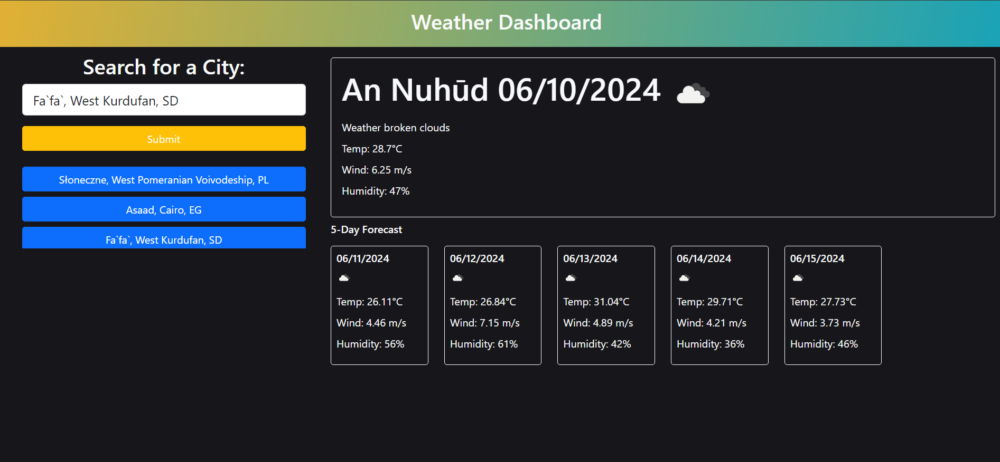

# Weather-Dashboard

## Table of Contents
- [Description](#description)
- [User Story](#user-story)
- [Acceptance Criteria](#acceptance-criteria)
- [Mock-Up](#mock-up)
- [Repository Link](#repository-link)
- [Deployed Application](#deployed-application)
- [Example Application](#example-application)

## Description
In this task, we need to create a weather dashboard that operates in the browser and dynamically updates HTML and CSS. To achieve this, we'll utilize the OpenWeatherMap API to fetch weather data for cities. You'll need to send a request with the coordinates of the city rather than its name. Additionally, we'll make use of localStorage to store persistent data.

## User Story

```
AS A traveler
I WANT to see the weather outlook for multiple cities
SO THAT I can plan a trip accordingly
```

## Acceptance Criteria

```
GIVEN a weather dashboard with form inputs
WHEN I search for a city
THEN I am presented with current and future conditions for that city and that city is added to the search history
WHEN I view current weather conditions for that city
THEN I am presented with the city name, the date, an icon representation of weather conditions, the temperature, the humidity, and the wind speed
WHEN I view future weather conditions for that city
THEN I am presented with a 5-day forecast that displays the date, an icon representation of weather conditions, the temperature, the wind speed, and the humidity
WHEN I click on a city in the search history
THEN I am again presented with current and future conditions for that city
```

## Mock-Up

The following demonstrates the application functionality:


## Repository Link
[My blog Repository](https://github.com/iKeyToLife/Weather-Dashboard/)

## Deployed Application
[My blog Deployed Application](https://ikeytolife.github.io/Weather-Dashboard/)

## Example Application
